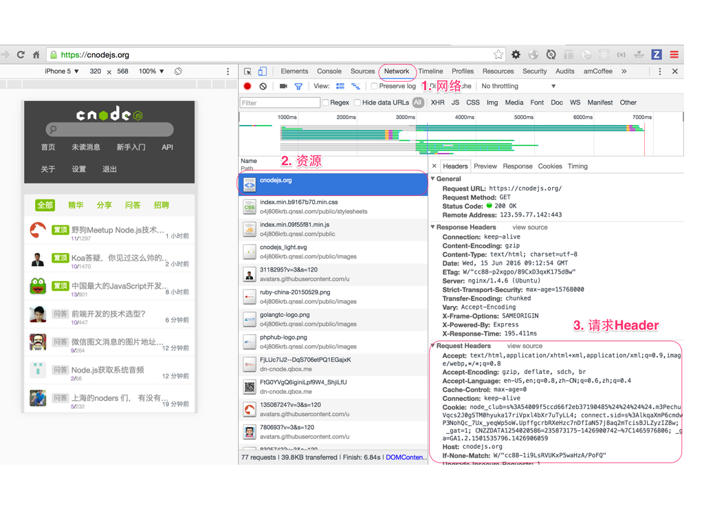

# 哇，原来http可以这么简单？

只要大家是js沾边工程师，http是无法躲过的、必须掌握的技能，可是看看


其实，你不必所有都掌握的，掌握下面这些就足够了

- Chrome调试与http
- http基础：GET/POST/上传
- 表单
- 异步：ajax
- 使用Node.js实现服务端
- 工具postman
- 命令行cUrl
- 总结：三层架构


# 三层架构


# 二个核心：req和res


> HTTP协议是无状态协议

# Chrome调试与http

对于前、后、移动端来讲，Chrome调试都是必备技能，Chrome调试对于前端和移动端的重要性就不用讲了，对于用的最少的后端来说，多少要写些页面，而且后端大部分都有debug经验，所以掌握Chrome调试是非常简单的。



- cnode首页，讲解简单的http信息
- cnode首页刷新第二次，体会etag的好处

# http基础

## 协议概述

HTTP是一个客户端终端（用户）和服务器端（网站）请求和应答的标准（TCP）。通过使用Web浏览器、网络爬虫或者其它的工具，客户端发起一个HTTP请求到服务器上指定端口（默认端口为80）。我们称这个客户端为用户代理程序（user agent）。应答的服务器上存储着一些资源，比如HTML文件和图像。我们称这个应答服务器为源服务器（origin server）。在用户代理和源服务器中间可能存在多个“中间层”，比如代理服务器、网关或者隧道（tunnel）。

尽管TCP/IP协议是互联网上最流行的应用，HTTP协议中，并没有规定必须使用它或它支持的层。事实上，HTTP可以在任何互联网协议上，或其他网络上实现。HTTP假定其下层协议提供可靠的传输。因此，任何能够提供这种保证的协议都可以被其使用。因此也就是其在TCP/IP协议族使用TCP作为其传输层。

通常，由HTTP客户端发起一个请求，创建一个到服务器指定端口（默认是80端口）的TCP连接。HTTP服务器则在那个端口监听客户端的请求。一旦收到请求，服务器会向客户端返回一个状态，比如"HTTP/1.1 200 OK"，以及返回的内容，如请求的文件、错误消息、或者其它信息。

## 请求信息（Request Message）

发出的请求信息包括以下几个

- 请求行
  - 例如GET /images/logo.gif HTTP/1.1，表示从/images目录下请求logo.gif这个文件。
-（请求）头，
  - 例如Accept-Language: en
- 空行
- 其他消息体

请求行和标题必须以<CR><LF>作为结尾。空行内必须只有<CR><LF>而无其他空格。在HTTP/1.1协议中，所有的请求头，除Host外，都是可选的。

当我们在地址栏输入https://cnodejs.org/时，浏览器将显示cnode的首页。在这个过程中，浏览器都干了哪些事情呢？通过Network的记录，我们就可以知道，在Network中，定位到第一条记录，点击，右侧将显示Request Headers，点击右侧的view source，我们就可以看到浏览器发给cnode服务器的请求：


## URL

URL，是uniform resource locator，统一资源定位器，它可以用来标识一个资源，指明了如何定位这个资源。通俗点说，web上有大量的资源，如何找到所需资源呢，这就要靠URL来定位。

URL用一种统一的格式来描述各种信息资源，包括文件、服务器的地址和目录等。
URL一般由三部组成:
1. 协议(或称为服务方式) 例如：http://
2. 存有该资源的主机IP地址(有时也包括端口号)或服务器域名  例如：127.0.0.1:3000 和 www.baidu.com
3. 主机资源的具体地址。如目录和文件名等，/photo/1.jpg

这是一个完整的URL实例：

http://www.runoob.com/nodejs/nodejs-url.html

## path


如果我们想访问`http://127.0.0.1:3000/topic?a=1`呢？

http/query/app-2.js代码

```
const Koa = require('koa');
const app = new Koa();

// response
app.use(ctx => {
  if (ctx.path === '/topic') {
   ctx.body = ' Hello Koa ' + ctx.path + ' a='+ ctx.query['a'];
  }
  
   ctx.body = ' Hello Koa with default path = ' + ctx.path  ;
});

app.listen(3000);
```

启动服务器

```
$ node query/app-2.js
```

访问http://127.0.0.1:3000/topic?a=1

返回` Hello Koa /topic a=1`

如果此时访问`http://127.0.0.1:3000/?a=1`呢？

返回` Hello Koa with default path = /`

## querystring

Koa最简单的获取querystring参数

创建文件 http/query/app.js

```
const Koa = require('koa');
const app = new Koa();

// response
app.use(ctx => {
  ctx.body = 'Hello Koa-' + ctx.query['a'];
});

app.listen(3000);
```

注：ctx.query是ctx.request.query的别名，即ctx.query === ctx.request.query 。

启动服务器

```
$ node query/app.js
```

然后访问`http://127.0.0.1:3000/?a=1`,此时页面显示“Hello Koa-1”，这里的`1`即`ctx.query['a']`

提问

> ctx.query只有get里可以用么？


## http status code


当浏览者访问一个网页时，浏览者的浏览器会向网页所在服务器发出请求。当浏览器接收并显示网页前，此网页所在的服务器会返回一个包含HTTP状态码的信息头（server header）用以响应浏览器的请求。
HTTP状态码的英文为HTTP Status Code。
下面是常见的HTTP状态码：

-  500 : 'Internal Server Error',
-  403 : 'Forbidden',
-  404 : 'Not Found',
-  304 : 'Not Modified',
-  200 : 'OK',

还有很多，可参考http://www.restapitutorial.com/httpstatuscodes.html

https://github.com/nodejs/io.js/blob/master/lib/_http_server.js


## http verbs

verbs = 动词

http://www.w3.org/Protocols/rfc2616/rfc2616-sec9.html

- get
- post
- delete
- put


```
// respond with "Hello World!" on the homepage
app.get('/user:id', function (req, res) {
  res.send('Hello World!');
});

// accept POST request on the homepage
app.post('/user/create', function (req, res) {
  res.send('Got a POST request');
});

// accept PUT request at /user
app.put('/user/:id', function (req, res) {
  res.send('Got a PUT request at /user');
});

// accept DELETE request at /user
app.delete('/user/:id', function (req, res) {
  res.send('Got a DELETE request at /user');
});
```

更多node里的verbs实行，见 https://github.com/jshttp/methods/blob/master/index.js

## 总结一下

- ctx.path 是请求的路径
- ctx.query 获取的querystring
- ctx.body 是返回浏览器页面的文本

以`/topic?a=1`为例

- ctx.path === '/topic'
- ctx.query === '?a=1'

这样便于大家理解path和query的含义。

下面，我们想一下这里处理了2个请求，请求1是`/topic`,请求2是`/topic`以外的其他请求。如果我们再往极限一点想呢？比如有10个、100个请求怎么办？写一个无数个if/else么？

# 表单

## get

## post

## upload


# 异步：ajax

## get

## post

## upload


# 使用Node.js实现服务端

## req取参数的3种方法

expressjs里的请求参数，4.x里只有3种

- req.params
- req.body
- req.query


已经废弃的api

- req.param(Deprecated. Use either req.params, req.body or req.query, as applicable.)


### req.params

```
app.get('/user/:id', function(req, res){
  res.send('user ' + req.params.id);
});
```

俗点：取带冒号的参数

### req.body

Contains key-value pairs of data submitted in the request body. By default, it is undefined, and is populated when you use body-parsing middleware such as body-parser and multer.

This example shows how to use body-parsing middleware to populate req.body.

```
var app = require('express')();
var bodyParser = require('body-parser');
var multer = require('multer'); 

app.use(bodyParser.json()); // for parsing application/json
app.use(bodyParser.urlencoded({ extended: true })); // for parsing application/x-www-form-urlencoded
app.use(multer()); // for parsing multipart/form-data

app.post('/', function (req, res) {
  console.log(req.body);
  res.json(req.body);
})
```

可以肯定的一点是req.body一定是post请求，express里依赖的中间件必须有bodyParser，不然req.body是没有的。

详细的说明在下面的3种post用法里。

### req.query

query是querystring

说明req.query不一定是get

```
// GET /search?q=tobi+ferret
req.query.q
// => "tobi ferret"

// GET /shoes?order=desc&shoe[color]=blue&shoe[type]=converse
req.query.order
// => "desc"

req.query.shoe.color
// => "blue"

req.query.shoe.type
// => "converse"
```

因为有变态的写法

```
// POST /search?q=tobi+ferret
{a:1,b:2}
req.query.q
// => "tobi ferret"
```

post里看不的，用req.body取。

## 准备工作

```
var app = express();
var multer  = require('multer')

// for raw data
app.use(function(req, res, next){
  if (req.is('text/*')) {
    req.text = '';
    req.setEncoding('utf8');
    req.on('data', function(chunk){ req.text += chunk });
    req.on('end', next);
  } else {
    next();
  }
});

app.use(multer({ 
	dest: './uploads/',
  rename: function (fieldname, filename) {
    return filename.replace(/\W+/g, '-').toLowerCase() + Date.now()
  }
}))
```

说明

- express4之后上传组件使用multer
- express4之前是由req.text的，但不知道是什么原因在4里取消了。

## 3种不同类型的post


```
var express = require('express');
var router = express.Router();

/* GET users listing. */
router.get('/', function(req, res) {
  res.send('respond with a resource');
});

router.get('/:id', function(req, res) {
  res.send('respond with a resource' + request.params.id);
});

router.post('/post', function(req, res) {
  // res.send('respond with a resource');
	res.json(req.body);
});

router.post('/post/formdata', function(req, res) {
  // res.send('respond with a resource');
	console.log(req.body, req.files);
	console.log(req.files.pic.path);
	res.json(req.body);
});

router.post('/post/raw', function(req, res) {
  // res.send('respond with a resource');
	res.json(req.text);
});


module.exports = router;
```


### Post with x-www-form-urlencoded

see post.html


```
	<script>
	$(function(){
		$.ajaxSetup({
		  contentType: "application/x-www-form-urlencoded; charset=utf-8"
		});
	
		$.post("/users/post", { name: "i5a6", time: "2pm" },
		   function(data){
		     console.log(data);
		   }, "json");
		 
	});
	</script>
```

in routes/users.js

```
	router.post('/post', function(req, res) {
	  // res.send('respond with a resource');
		res.json(req.body);
	});
```


### Post with form-data

主要目的是为了上传

	npm install --save multer


Usage

```
var express = require('express')
var multer  = require('multer')

var app = express()
app.use(multer({ dest: './uploads/'}))
```

You can access the fields and files in the request object:

```
console.log(req.body)
console.log(req.files)
```

重要提示： Multer will not process any form which is not multipart/form-data

[see more](https://github.com/expressjs/multer)


### Post with raw


To get the raw body content of a request with Content-Type: "text/plain" into req.rawBody you can do:

https://gist.github.com/tj/3750227


req.rawBody已经被干掉了，现在只能用req.text

下面是tj给出的代码片段

```
var express = require('./')
var app = express();
 
app.use(function(req, res, next){
  if (req.is('text/*')) {
    req.text = '';
    req.setEncoding('utf8');
    req.on('data', function(chunk){ req.text += chunk });
    req.on('end', next);
  } else {
    next();
  }
});
 
app.post('/', function(req, res){
  res.send('got "' + req.text + '"');
});
 
app.listen(3000)
```


# 测试


# 工具postman


> 它除了是工具外，最大的好处是有助于你理解http协议

# 命令行cUrl

```
#! /bin/bash

echo -n "post common"
curl -d "a=1&b=2" http://127.0.0.1:3001/users/post

echo -n 'post formdata'
curl -F 'pic=@"img/post-common.png"' -F 'a=1' -F 'b=2'  http://127.0.0.1:3001/users/post/formdata

echo -n 'post raw json'

curl -d "{"a":"1","b":"2","c":{"a":"1","b":"2"}}" http://127.0.0.1:3001/users/post
```

如不清楚，请 `man curl`.

# 总结：more

- 玩出乐趣，想想本文是怎么玩的？
- 利用好时间：闲时要有吃紧的心思，忙里要有偷闲的乐趣
- 少抱怨，多思考，未来更美好
