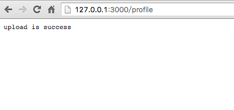
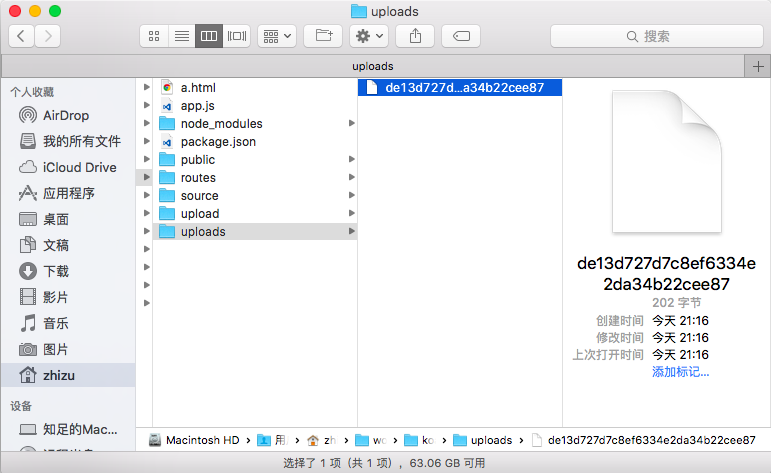
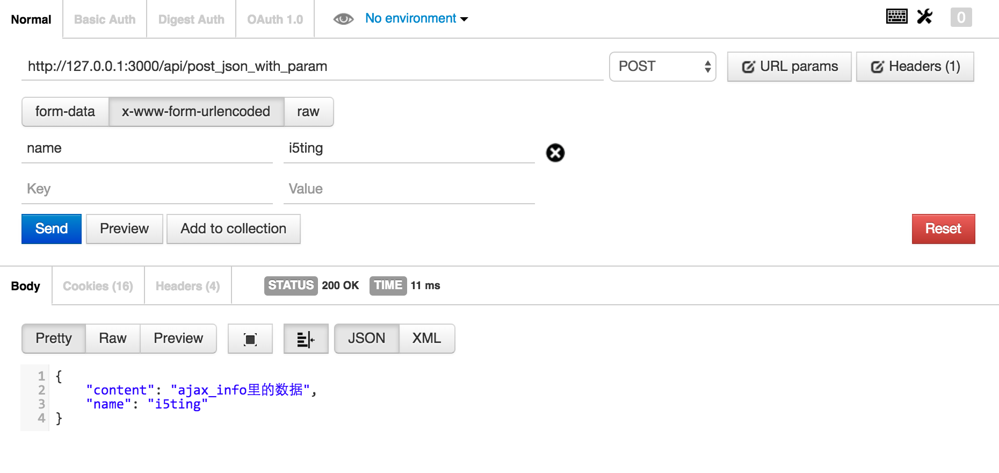
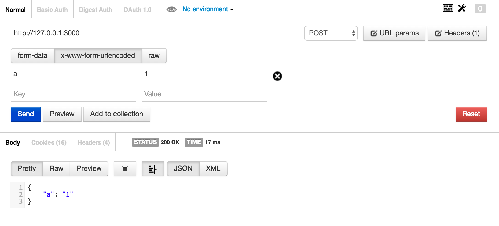

# 哇，原来http可以这么简单？

只要大家是js沾边工程师，http是无法躲过的、必须掌握的技能，可是看看


其实，你不必所有都掌握的，掌握下面这些就足够了

- 三层架构
- 二个核心：req和res
- 一个记住：无状态
- Chrome调试与http
- http基础：GET/POST/上传
- 表单
- 异步：ajax
- 使用Node.js实现服务端
- 工具postman
- 命令行cUrl
- 总结


# 三层架构


# 二个核心：req和res


# 一个记住：无状态

> HTTP协议是无状态协议

区分session是服务器的实现，而非http协议

# Chrome调试与http

对于前、后、移动端来讲，Chrome调试都是必备技能，Chrome调试对于前端和移动端的重要性就不用讲了，对于用的最少的后端来说，多少要写些页面，而且后端大部分都有debug经验，所以掌握Chrome调试是非常简单的。


- cnode首页，讲解简单的http信息
- cnode首页刷新第二次，体会etag的好处

# http基础

## 协议概述

HTTP是一个客户端终端（用户）和服务器端（网站）请求和应答的标准（TCP）。通过使用Web浏览器、网络爬虫或者其它的工具，客户端发起一个HTTP请求到服务器上指定端口（默认端口为80）。我们称这个客户端为用户代理程序（user agent）。应答的服务器上存储着一些资源，比如HTML文件和图像。我们称这个应答服务器为源服务器（origin server）。在用户代理和源服务器中间可能存在多个“中间层”，比如代理服务器、网关或者隧道（tunnel）。

尽管TCP/IP协议是互联网上最流行的应用，HTTP协议中，并没有规定必须使用它或它支持的层。事实上，HTTP可以在任何互联网协议上，或其他网络上实现。HTTP假定其下层协议提供可靠的传输。因此，任何能够提供这种保证的协议都可以被其使用。因此也就是其在TCP/IP协议族使用TCP作为其传输层。

通常，由HTTP客户端发起一个请求，创建一个到服务器指定端口（默认是80端口）的TCP连接。HTTP服务器则在那个端口监听客户端的请求。一旦收到请求，服务器会向客户端返回一个状态，比如"HTTP/1.1 200 OK"，以及返回的内容，如请求的文件、错误消息、或者其它信息。

## 请求信息（Request Message）

发出的请求信息包括以下几个

- 请求行
  - 例如GET /images/logo.gif HTTP/1.1，表示从/images目录下请求logo.gif这个文件。
-（请求）头，
  - 例如Accept-Language: en
- 空行
- 其他消息体

请求行和标题必须以<CR><LF>作为结尾。空行内必须只有<CR><LF>而无其他空格。在HTTP/1.1协议中，所有的请求头，除Host外，都是可选的。

当我们在地址栏输入https://cnodejs.org/时，浏览器将显示cnode的首页。在这个过程中，浏览器都干了哪些事情呢？通过Network的记录，我们就可以知道，在Network中，定位到第一条记录，点击，右侧将显示Request Headers，点击右侧的view source，我们就可以看到浏览器发给服务器的请求。

## URL

URL，是uniform resource locator，统一资源定位器，它可以用来标识一个资源，指明了如何定位这个资源。通俗点说，web上有大量的资源，如何找到所需资源呢，这就要靠URL来定位。

URL用一种统一的格式来描述各种信息资源，包括文件、服务器的地址和目录等。
URL一般由三部组成:
1. 协议(或称为服务方式) 例如：http://
2. 存有该资源的主机IP地址(有时也包括端口号)或服务器域名  例如：127.0.0.1:3000 和 www.baidu.com
3. 主机资源的具体地址。如目录和文件名等，/photo/1.jpg

这是一个完整的URL实例：

> https://cnodejs.org/topic/579391c32d740f7c26637e1b?a=1&b=2

## path


如果我们想访问`http://127.0.0.1:3000/topic?a=1`呢？

http/query/app-2.js代码

```
const Koa = require('koa');
const app = new Koa();

// response
app.use(ctx => {
  if (ctx.path === '/topic') {
   ctx.body = ' Hello Koa ' + ctx.path + ' a='+ ctx.query['a'];
  }
  
   ctx.body = ' Hello Koa with default path = ' + ctx.path  ;
});

app.listen(3000);
```

启动服务器

```
$ node query/app-2.js
```

访问http://127.0.0.1:3000/topic?a=1

返回` Hello Koa /topic a=1`

如果此时访问`http://127.0.0.1:3000/?a=1`呢？

返回` Hello Koa with default path = /`

## querystring

Koa最简单的获取querystring参数

创建文件 http/query/app.js

```
const Koa = require('koa');
const app = new Koa();

// response
app.use(ctx => {
  ctx.body = 'Hello Koa-' + ctx.query['a'];
});

app.listen(3000);
```

注：ctx.query是ctx.request.query的别名，即ctx.query === ctx.request.query 。

启动服务器

```
$ node query/app.js
```

然后访问`http://127.0.0.1:3000/?a=1`,此时页面显示“Hello Koa-1”，这里的`1`即`ctx.query['a']`

提问

> ctx.query只有get里可以用么？


## http status code


当浏览者访问一个网页时，浏览者的浏览器会向网页所在服务器发出请求。当浏览器接收并显示网页前，此网页所在的服务器会返回一个包含HTTP状态码的信息头（server header）用以响应浏览器的请求。
HTTP状态码的英文为HTTP Status Code。
下面是常见的HTTP状态码：

-  500 : 'Internal Server Error',
-  403 : 'Forbidden',
-  404 : 'Not Found',
-  304 : 'Not Modified',
-  200 : 'OK',

还有很多，可参考http://www.restapitutorial.com/httpstatuscodes.html

https://github.com/nodejs/io.js/blob/master/lib/_http_server.js


## http verbs

verbs = 动词

http://www.w3.org/Protocols/rfc2616/rfc2616-sec9.html


http动词即请求方法

1. GET 请求指定的页面信息，并返回实体主体。
2. POST 向指定资源提交数据进行处理请求（例如提交表单或者上传文件）。数据被包含在请求体中。POST请求可能会导致新的资源的建立和/或已有资源的修改。
3. PUT	从客户端向服务器传送的数据取代指定的文档的内容。
4. DELETE	请求服务器删除指定的页面。


```
// respond with "Hello World!" on the homepage
app.get('/user:id', function (req, res) {
  res.send('Hello World!');
});

// accept POST request on the homepage
app.post('/user/create', function (req, res) {
  res.send('Got a POST request');
});

// accept PUT request at /user
app.put('/user/:id', function (req, res) {
  res.send('Got a PUT request at /user');
});

// accept DELETE request at /user
app.delete('/user/:id', function (req, res) {
  res.send('Got a DELETE request at /user');
});
```

更多node里的verbs实行，见 https://github.com/jshttp/methods/blob/master/index.js

## 总结一下

- ctx.path 是请求的路径
- ctx.query 获取的querystring
- ctx.body 是返回浏览器页面的文本

以`/topic?a=1`为例

- ctx.path === '/topic'
- ctx.query === '?a=1'

这样便于大家理解path和query的含义。

下面，我们想一下这里处理了2个请求，请求1是`/topic`,请求2是`/topic`以外的其他请求。如果我们再往极限一点想呢？比如有10个、100个请求怎么办？写一个无数个if/else么？

# 表单


## get

创建服务器 (http/get/app.js):

```
const Koa = require('koa');
const bodyParser = require ('koa-bodyparser');
const route = require('koa-router')();

const app = new Koa();

app.use(bodyParser());
app.use(require('koa-static')(__dirname + '/public'));

app.use(route.routes())
   .use(route.allowedMethods());
route.get('/topic', function (ctx, next) {
    ctx.body = 'Hello koa' + ctx.query['a'];
    console.log (ctx.query['vehicle']);
});

app.listen(3000);
```

启动服务器

```
$ node get/app.js
```

创建一段html表单代码（http/public/get.html）：

```
<form method="GET" action="/topic">
  <input type="text" name="a" value='1'><br><br>
  <input type="radio" name="sex" value="male">Male<br><br>
  <input type="radio" name="sex" value="female">Female<br><br>
  <input type="checkbox" name="vehicle" value="Bike">I have a bike<br><br>
  <input type="checkbox" name="vehicle" value="Car">I have a car<br><br>
  <input type="submit" value="OK">
</form>
```

访问`http://127.0.0.1:3000/get.html`地址,点击OK按钮,会向'/topic'提交GET请求


在shell中输出

```
Car
```

从上图可以看出，表单里的get数据实际会在url里的querystring里，会显示出来。


## post

创建服务器 (http/post/app.js):

```
const Koa = require('koa');
const bodyParser = require ('koa-bodyparser');
const route = require('koa-router')();

const app = new Koa();

app.use(bodyParser());
app.use(require('koa-static')(__dirname + '/public'));

// routes definition
app.use(route.routes())
   .use(route.allowedMethods());

route.post('/toc/aaa', function (ctx, next) {
    ctx.body = ctx.request.body['a'];
    console.log (ctx.request.body['vehicle']);
});

app.listen(3000);
```

启动服务器

```
$ node post/app.js
```

创建一段html表单代码（http/public/post.html）：

```
<form method="POST" action="/toc/aaa">
  <input type="text" name="a" value='1'><br><br>
  <input type="radio" name="sex" value="male">Male<br><br>
  <input type="radio" name="sex" value="female">Female<br><br>
  <input type="checkbox" name="vehicle" value="Bike">I have a bike<br><br>
  <input type="checkbox" name="vehicle" value="Car">I have a car<br><br>
  <input type="submit" value="OK">
</form>
```

访问`http://127.0.0.1:3000/post.html`地址，会向'/toc/aaa'提交POST请求


点击OK按钮


从上图可以看出，表单里的post数据实际是不会在url里的querystring里。

## 上传

安装中间件

```
$ npm install --save koa-multer
```

Koa中上传基本用法

创建上传文件存储目录：(http/uploads)
创建服务器 (http/app.js)

```
const Koa = require('koa');  // v2
const router = require('koa-router')(); // v6
const multer = require('koa-multer');

const app = new Koa();
const upload = multer({ dest: 'uploads/' });
app.use(require('koa-static')(__dirname + '/public'));
app.use(router.routes())
    .use(router.allowedMethods());

router.post('/profile', upload.single('upfiles'),function (ctx, next){
    ctx.body = "upload is success";
});

app.listen(3000);
```

see more  https://github.com/koa-modules/multer 和 https://github.com/expressjs/multer

启动服务器

```
$ node app.js
```

创建一段html表单代码：(http/public/upload.html)
```
<form method="POST" action="/profile" enctype='multipart/form-data'>
  请选择上传的文件：<input type="file" name="upfiles">
  <input type="submit" value="OK">
</form>
```

访问`http://127.0.0.1:3000/upload.html`地址

选择要上传的文件


上传成功



# 异步：ajax
## 什么是 ajax

Ajax即“Asynchronous Javascript And XML”（异步JavaScript和XML），是指一种创建交互式网页应用的网页开发技术。核心是XMLHttpRequest对象（简称XHR），可以通过使用XHR对象获取到服务器的数据，然后再通过DOM将数据插入到页面中呈现。虽然名字中包含XML，但Ajax通讯与数据格式无关，所以我们的数据格式可以是XML或JSON等格式。

XMLHttpRequest对象用于在后台与服务器交换数据，具体作用如下：

- 在不重新加载页面的情况下更新网页
- 在页面已加载后从服务器请求数据
- 在页面已加载后从服务器接收数据
- 在后台向服务器发送数据

四步

- 通过事件触发ajax请求
- 发送ajax请求
- 处理ajax请求结果，无论成功还是失败
- 处理完成后，根据业务，对页面进行dom操作或css样式操作

### 示例helloworld演示 

```
$ cd ajax/helloworld
$ ls
ajax_info.txt index.html
$ hs . -p 9090 -o 
Starting up http-server, serving .
Available on:
  http://127.0.0.1:9090
  http://192.168.1.105:9090
Hit CTRL-C to stop the server
[Thu May 26 2016 22:32:54 GMT+0800 (CST)] "GET /" "Mozilla/5.0 (Macintosh; Intel Mac OS X 10_10_5) AppleWebKit/537.36 (KHTML, like Gecko) Chrome/50.0.2661.102 Safari/537.36"
[Thu May 26 2016 22:32:55 GMT+0800 (CST)] "GET /favicon.ico" "Mozilla/5.0 (Macintosh; Intel Mac OS X 10_10_5) AppleWebKit/537.36 (KHTML, like Gecko) Chrome/50.0.2661.102 Safari/537.36"
[Thu May 26 2016 22:32:55 GMT+0800 (CST)] "GET /favicon.ico" Error (404): "Not found"
```

启动服务器命令说明

- hs 是node模块http-server的简写命令，用于启动http服务器
- `-p 9090`是设置端口的意思
- `-o` 在默认浏览器里打开网址

源码说明

- ajax_info.txt  文本文件，返回一段文字
- index.html    所有的代码

### 源码解析

index.html

```
<!DOCTYPE html>
<html>
  <head>
    <meta charset='uft-8' />
    <title> ajax hello world </title>
  </head>  
<body>
  <div id="demo"><h2>把AJAX返回的数据放到这里</h2></div>
  <button type="button" onclick="send_ajax_request()">改变内容</button>

  <script>
    function send_ajax_request() {
      var xhr = new XMLHttpRequest();
      xhr.onreadystatechange = function() {
        if (xhr.readyState == 4 && xhr.status == 200) {
          // dom
          document.getElementById("demo").innerHTML = xhr.responseText;
          // style
          document.getElementById('demo').style.background = "lightblue";
        }
      };
      xhr.open("GET", "ajax_info.txt", true);
      xhr.send();
    }
  </script>
</body>
</html>

```

四步骤要点

- 通过事件触发ajax请求

给按钮增加onclick事件，在点击的时候调用send_ajax_request()

```
<button type="button" onclick="send_ajax_request()">改变内容</button>
```

- 发送ajax请求（此时是request发送）

```
var xhr = new XMLHttpRequest();
xhr.onreadystatechange = function() {
    if (xhr.readyState == 4 && xhr.status == 200) {
       ...
    }
};
xhr.open("GET", "ajax_info.txt", true);
xhr.send();
```

在创建XHR对象后，接着我们要调用一个初始化方法open()，它接受五个参数具体定义如下：

```
void open(
   DOMString method, //"GET", "POST", "PUT", "DELETE"
   DOMString url,
   optional boolean async,
   optional DOMString user,
   optional DOMString password
);
```

这是完成的ajax请求代码，实际发送请求是通过send方法，即

```
xhr.send();
```

- 处理ajax请求结果，无论成功还是失败（此时是response处理）

```
if (xhr.readyState == 4 && xhr.status == 200) {
          // dom
          document.getElementById("demo").innerHTML = xhr.responseText;
          // style
          document.getElementById('demo').style.background = "lightblue";
        }
```

onreadystatechange 事件

当请求被发送到服务器时，我们需要执行一些基于响应的任务。每当 readyState 改变时，就会触发 onreadystatechange 事件。readyState 属性存有 XMLHttpRequest 的状态信息。

readyState属性 存有 XMLHttpRequest 的状态。从 0 到 4 发生变化（
每个请求发送onreadystatechange 事件就会被触发 5 次（0 - 4），对应着 readyState 的每个变化。）

- 0: 请求未初始化
- 1: 服务器连接已建立
- 2: 请求已接收
- 3: 请求处理中
- 4: 请求已完成，且响应已就绪

status是http状态码，给出常见的几种

- 500 : 'Internal Server Error服务器内部错误',
- 403 : 'Forbidden禁止访问',
- 404 : 'Not Found未找到页面',
- 304 : 'Not Modified没有更改',
- 200 : 'OK',

在 onreadystatechange 事件中，我们规定当服务器响应已做好被处理的准备时所执行的任务。

当 readyState 等于 4 且状态为 200 时，表示响应已就绪，即此时你可以对response返回的数据或文本进行处理。


- 处理完成后，根据业务，对页面进行dom操作或css样式操作

对页面进行dom操作

```
document.getElementById("demo").innerHTML = xhr.responseText;
```

对页面进行css样式操作

```
document.getElementById('demo').style.background = "lightblue";
```

### 问题

- 连续点击【改变内容】按钮，为什么不再改变？
- 为什么刷新会回到之前的内容？

### 这里response(服务器响应)处理的文本，那么用的最多的是什么呢？


如需获得来自服务器的响应，请使用 XMLHttpRequest 对象的 responseText 或 responseXML 属性。

- xhr.responseText	获得字符串形式的响应数据。
- xhr.responseXML	获得 XML 形式的响应数据。

可以任意类型，主要有

- xml（使用xhr.responseXML）
- text文本（xhr.responseText）
- json（xhr.responseText）

虽然ajax里面的x是xml的意思，但实际情况xml用的极其的少，除了web service外，绝大部分情况我们会使用json作为服务端响应数据类型


> 一般讲，api开发（Application Programming Interface）泛指以返回json作为接口的服务端编程。

### 简单的json api示例

```
$ cd book-source/http/ajax/json
$ hs . -p 9091 -o
$ ls
data.json  index.html
```

源码说明

- data.json  文本文件，返回json对象
- index.html    所有的代码

data.json

```
{
  "content": "ajax_info里的数据"
}
```

index.html

```
<!DOCTYPE html>
<html>
  <head>
    <meta charset='uft-8' />
    <title> ajax with json </title>
  </head>  
<body>
  <div id="demo"><h2>把AJAX返回的数据放到这里</h2></div>
  <button type="button" onclick="send_ajax_request()">改变内容</button>

  <script>
    function send_ajax_request() {
      var xhr = new XMLHttpRequest();
      xhr.onreadystatechange = function() {
        if (xhr.readyState == 4 && xhr.status == 200) {
          // json parse
          var data = JSON.parse(xhr.responseText)
          // dom
          document.getElementById("demo").innerHTML = data.content;
          // style
          document.getElementById('demo').style.background = "lightblue";
        }
      };
      xhr.open("GET", "data.json", true);
      xhr.send();
    }
  </script>
</body>
</html>
```

相比较之前的text方式，差异如下

1)请求地址变了，是"data.json"

```
xhr.open("GET", "data.json", true);
```

2）处理完成后，先解析xhr.responseText为json，对页面进行dom操作或css样式操作

```
if (xhr.readyState == 4 && xhr.status == 200) {
    // 先解析xhr.responseText为json
    var data = JSON.parse(xhr.responseText)
    // dom
    document.getElementById("demo").innerHTML = data.content;
    // style
    document.getElementById('demo').style.background = "lightblue";
}
```

其他操作都是一样的。

### ajax与表单

上节讲了表单是用来页面之间传值用的，无论get还是post，它都会跳转到action对应的页面。而ajax是在当前页面就可以完成请求与响应，无需跳转，这是它们之间的差异。它们各自有各自的特点，比如

- 有些页面是需要跳转的，比如登录、注册
- 大部分页面为了有更好的体验，使用ajax，无刷新页面完成请求

那么ajax如何实现和表单一样的传值呢？


### GET 还是 POST？
与 POST 相比，GET 更简单也更快，并且在大部分情况下都能用。

然而，在以下情况中，请使用 POST 请求：

- 无法使用缓存文件（更新服务器上的文件或数据库）
- 向服务器发送大量数据（POST 没有数据量限制）
- 发送包含未知字符的用户输入时，POST 比 GET 更稳定也更可靠

## 写一个接口

使用koa编写这个demo，用到2个模块就够了

1) 第一步`npm init`，会生成package.json文件

2) 安装依赖

```
$ npm i -S koa@next
$ npm i -S koa-static@next
```

在package.json里会自动增加2条依赖

```
"dependencies": {
    "koa": "^2.0.0",
    "koa-static": "^3.0.0"
}
```

3) 创建app.js


```
$ touch app.js
```

在app.js里放入下面代码即可

```
var serve = require('koa-static');
var Koa = require('koa');
var app = new Koa();

// 启用静态httpserver
app.use(serve(__dirname + '/public'));

// 定义json接口
app.use(ctx => {
  if (ctx.path === '/api/json') {
    ctx.body = {
      "content": "ajax_info里的数据"
    }
  } else {
    ctx.body = {
      "error": "请使用 /api/json 作为请求地址"
    }
  }
});

app.listen(3000);

console.log('listening on port 3000');
```

说明

- 启用静态httpserver
- 定义了一个接口

4）启动、测试

```
$ node app.js 
listening on port 3000
```
在浏览器里打开http://127.0.0.1:3000/api/json

返回如下

```
// 20160527073015
// http://127.0.0.1:3000/api/json

{
  "content": "ajax_info里的数据"
}
```

更多，模拟接口的见https://github.com/typicode/json-server

## 加上参数


### get

get请求是通过querystring进行传值

```
if (ctx.path === '/api/get_json_with_param') {
    console.log(ctx.query)
    var name = ctx.query.name
    ctx.body = {
        "content": "ajax_info里的数据",
        "name": name
    }
}
```

http://127.0.0.1:3000/api/get_json_with_param?name=i5ting

### post

koa默认是不支持post请求的，需要使用bodyparser模块

```
npm i -S koa-bodyparser@next
```

修改app.js代码

```
var serve = require('koa-static');
var bodyParser = require('koa-bodyparser');
var Koa = require('koa');
var app = new Koa();

// 处理post请求
app.use(bodyParser());

// 启用静态httpserver
app.use(serve(__dirname + '/public'));
```

下面来看一下post请求代码如何处理

```
if (ctx.path === '/api/post_json_with_param') {
    console.log(ctx.request.body)
    var name = ctx.request.body.name
    ctx.body = {
        "content": "ajax_info里的数据",
        "name": name
    }
}
```

get请求可以在浏览器里显示的测试，而post是不能直接通过url测试的，所以为了简便，我们这里使用chrome的插件postman测试。注意post的类型是x-www-form-urlencoded。



### 总结

至此，我们把koa的get和post返回json api的代码就都讲完了，有了这些api，我们就可以尝试ajax和json api进行联调。

自己实现ajax https://github.com/nodeonly/minAjax.js/blob/master/index.js

## jQuery ajax

jQuery是最常用的库，

zepto是jQuery的移动版，所有接口和jQ是一样的。


通过 jQuery AJAX 方法，您能够使用 HTTP Get 和 HTTP Post 从远程服务器上请求文本、HTML、XML 或 JSON - 同时您能够把这些外部数据直接载入网页的被选元素中。
如果没有 jQuery，AJAX 编程还是有些难度的。
编写常规的 AJAX 代码并不容易，因为不同的浏览器对 AJAX 的实现并不相同。这意味着您必须编写额外的代码对浏览器进行测试。不过，jQuery 团队为我们解决了这个难题，我们只需要一行简单的代码，就可以实现 AJAX 功能。

在使用Ajax前，需要下载jQuery库，并在页面中引入`<script src="jquery.js"></script>`。

我们这里使用最多的jQuery库举例

```
$.get("test.cgi", { name: "John", time: "2pm" }, function( data ) {
    // 处理ajax请求结果
    alert( "Data Loaded: " + data );
    // 根据业务，对页面进行dom操作或css样式操作
    $(sss).html().css()
});
```

- 使用$.get或$.post发送ajax请求。可以理解它是对原生的xhr封装
- 在回调中`function( data ) {}`里处理ajax请求结果
- `$(sss).html().css()`对页面进行dom操作或css样式操作

https://github.com/DevMountain/mini-ajax


jQuery Ajax使用方法与 Ajax 相似，写接口、创建服务器、启动服务器，与Ajax相同，这里不再重复。

给出app.js 源码

```
var koa = require ('koa');
var serve = require ('koa-static');
var bodyParser = require ('koa-bodyparser');

var app = new koa();

app.use (bodyParser());
app.use (serve(__dirname + '/public'));
app.use ( ctx => {
    if(ctx.path === '/api/get_json_with_param'){
        console.log(ctx.query);
        var name = ctx.query.name;
        ctx.body = {
            "content":"ajax_info里的数据",
            "name": name
        }
    } else if (ctx.path === '/api/post_json_with_param') {
        console.log(ctx.request.body)
        var name = ctx.request.body.name
        ctx.body = {
            "content": "post_json_with_param里的数据",
            "name": name
        }
    } else {
        ctx.body = {
            "error":"请使用 /api/json 作为请求地址"
        }
    }
});

app.listen(3000);

console.log ("listening on port 3000");
```

启动服务器

```
$node app.js
```
以表单为例，介绍如何使用$.get或$.post发送ajax请求

同样5步骤

- 通过事件触发ajax请求
- 通过dom获取表单数据值
- 组装表单数据值，发送ajax请求
- 处理ajax请求结果，无论成功还是失败
- 处理完成后，根据业务，对页面进行dom操作或css样式操作


引入jQuery 库
```
<head>
    <meta charset='uft-8' />
    <title> ajax with json </title>
    <script src="/script/jquery.js"></script>
</head> 
```

### get

$.get(url,[data],[callback])

- url (String) 发送请求的URL地址.
- data (Map)(可选参数) 要发送给服务器的数据，以 Key/value 的键值对形式表示，会做为QueryString附加到请求URL中
- callback (Callback) (可选参数) 载入成功时回调函数(只有当Response的返回状态是success才是调用该方法)，该函数接受两个参数，第一个为服务器返回的数据，第二个参数为服务器的状态。

```
  <form> 
    <input type='text' name='username' value='i5ting' id='myname'/>
    <div id="demo"><h2>把AJAX返回的数据放到这里</h2></div>
    <button id="bt1" type="button">发送get请求</button>
    <button id="bt2" type="button">发送post请求</button>
  </form>
  <script>
      $('#bt1').click( function () {  // 触发ajax请求
          var name1 = $("#myname").val(); // 获取表单数据值
            console.log(name1);  // 打印取到的表单值
            $.get ('/api/get_json_with_param', {name:name1}, function (data,status) {
            // function (data,staus)中，data为服务器返回数据，status为服务器状态
             
            $('#demo').html("get返回的结果" + data.name).css('background','lightblue');
            console.log (data); // 打印返回数据
         });
       });
  </script>
```

### post

$.post(url,[data],[callback],[type])

这个函数跟$.get()参数差不多。
- url (String) 发送请求的URL地址.
- data (Map)(可选参数) 要发送给服务器的数据，以 Key/value 的键值对形式表示
- callback (Callback) (可选参数) 载入成功时回调函数(只有当Response的返回状态是success才是调用该方法)
- type (String) (可选参数) 请求数据的类型，xml,text,json等,如果我们设置这个参数为：json，那么返回的格式则是json格式的，如果没有设置，就 和$.get()返回的格式一样，都是字符串的

```
  <form> 
    <input type='text' name='username' value='i5ting' id='myname'/>
    <div id="demo"><h2>把AJAX返回的数据放到这里</h2></div>
    <button id="bt1" type="button">发送get请求</button>
    <button id="bt2" type="button">发送post请求</button>
  </form>
  <script>
    $('#bt2').click( function () {
       var name1 = $("#myname").val();
       console.log(name1);
       $.post ('/api/post_json_with_param', {name:name1},function (data,status) {
          $('#demo').html("post返回的结果" + data.name).css('background','red');
          console.log (data); // 打印返回数据
      });
    });
  </script>
```

# 使用Node.js实现服务端

## req取参数的3种方法

expressjs里的请求参数，4.x里只有3种

- req.params
- req.body
- req.query


已经废弃的api

- req.param(Deprecated. Use either req.params, req.body or req.query, as applicable.)


### req.params

```
app.get('/user/:id', function(req, res){
  res.send('user ' + req.params.id);
});
```

俗点：取带冒号的参数

### req.body

Contains key-value pairs of data submitted in the request body. By default, it is undefined, and is populated when you use body-parsing middleware such as body-parser and multer.

This example shows how to use body-parsing middleware to populate req.body.

```
var app = require('express')();
var bodyParser = require('body-parser');
var multer = require('multer'); 

app.use(bodyParser.json()); // for parsing application/json
app.use(bodyParser.urlencoded({ extended: true })); // for parsing application/x-www-form-urlencoded
app.use(multer()); // for parsing multipart/form-data

app.post('/', function (req, res) {
  console.log(req.body);
  res.json(req.body);
})
```

可以肯定的一点是req.body一定是post请求，express里依赖的中间件必须有bodyParser，不然req.body是没有的。

详细的说明在下面的3种post用法里。

### req.query

query是querystring

说明req.query不一定是get

```
// GET /search?q=tobi+ferret
req.query.q
// => "tobi ferret"

// GET /shoes?order=desc&shoe[color]=blue&shoe[type]=converse
req.query.order
// => "desc"

req.query.shoe.color
// => "blue"

req.query.shoe.type
// => "converse"
```

因为有变态的写法

```
// POST /search?q=tobi+ferret
{a:1,b:2}
req.query.q
// => "tobi ferret"
```

post里看不的，用req.body取。

## 准备工作

```
var app = express();
var multer  = require('multer')

// for raw data
app.use(function(req, res, next){
  if (req.is('text/*')) {
    req.text = '';
    req.setEncoding('utf8');
    req.on('data', function(chunk){ req.text += chunk });
    req.on('end', next);
  } else {
    next();
  }
});

app.use(multer({ 
	dest: './uploads/',
  rename: function (fieldname, filename) {
    return filename.replace(/\W+/g, '-').toLowerCase() + Date.now()
  }
}))
```

说明

- express4之后上传组件使用multer
- express4之前是由req.text的，但不知道是什么原因在4里取消了。

## 3种不同类型的post


```
var express = require('express');
var router = express.Router();

/* GET users listing. */
router.get('/', function(req, res) {
  res.send('respond with a resource');
});

router.get('/:id', function(req, res) {
  res.send('respond with a resource' + request.params.id);
});

router.post('/post', function(req, res) {
  // res.send('respond with a resource');
	res.json(req.body);
});

router.post('/post/formdata', function(req, res) {
  // res.send('respond with a resource');
	console.log(req.body, req.files);
	console.log(req.files.pic.path);
	res.json(req.body);
});

router.post('/post/raw', function(req, res) {
  // res.send('respond with a resource');
	res.json(req.text);
});


module.exports = router;
```


### Post with x-www-form-urlencoded

see post.html


```
	<script>
	$(function(){
		$.ajaxSetup({
		  contentType: "application/x-www-form-urlencoded; charset=utf-8"
		});
	
		$.post("/users/post", { name: "i5a6", time: "2pm" },
		   function(data){
		     console.log(data);
		   }, "json");
		 
	});
	</script>
```

in routes/users.js

```
	router.post('/post', function(req, res) {
	  // res.send('respond with a resource');
		res.json(req.body);
	});
```


### Post with form-data

主要目的是为了上传

	npm install --save multer


Usage

```
var express = require('express')
var multer  = require('multer')

var app = express()
app.use(multer({ dest: './uploads/'}))
```

You can access the fields and files in the request object:

```
console.log(req.body)
console.log(req.files)
```

重要提示： Multer will not process any form which is not multipart/form-data

[see more](https://github.com/expressjs/multer)


### Post with raw


To get the raw body content of a request with Content-Type: "text/plain" into req.rawBody you can do:

https://gist.github.com/tj/3750227


req.rawBody已经被干掉了，现在只能用req.text

下面是tj给出的代码片段

```
var express = require('./')
var app = express();
 
app.use(function(req, res, next){
  if (req.is('text/*')) {
    req.text = '';
    req.setEncoding('utf8');
    req.on('data', function(chunk){ req.text += chunk });
    req.on('end', next);
  } else {
    next();
  }
});
 
app.post('/', function(req, res){
  res.send('got "' + req.text + '"');
});
 
app.listen(3000)
```


# 测试

## 单元测试：http接口

- https://github.com/visionmedia/supertest
- https://github.com/i5ting/superkoa

```
var request = require('supertest');
var express = require('express');

var app = express();

app.get('/user', function(req, res) {
  res.status(200).json({ name: 'tobi' });
});

request(app)
  .get('/user')
  .expect('Content-Type', /json/)
  .expect('Content-Length', '15')
  .expect(200)
  .end(function(err, res) {
    if (err) throw err;
  });
```

## 集成测试：有ui界面的

https://github.com/assaf/zombie

```
const Browser = require('zombie');

// We're going to make requests to http://example.com/signup
// Which will be routed to our test server localhost:3000
Browser.localhost('example.com', 3000);

describe('User visits signup page', function() {

  const browser = new Browser();

  before(function(done) {
    browser.visit('/signup', done);
  });

  describe('submits form', function() {

    before(function(done) {
      browser
        .fill('email',    'zombie@underworld.dead')
        .fill('password', 'eat-the-living')
        .pressButton('Sign Me Up!', done);
    });

    it('should be successful', function() {
      browser.assert.success();
    });

    it('should see welcome page', function() {
      browser.assert.text('title', 'Welcome To Brains Depot');
    });
  });
});
```

## 更多

测试如果要细讲，内容是相当多的，以后再说吧

- 什么是测试？
  - 编码境界
  - 测试的好处
  - 红到绿(重构)工作流
  - 单元测试的分类
  - 测试框架举例
- ava是什么？
  - 用法（含gulp）
  - 同步异步
  - 三种：普通函数（promise或thunks）、generator、async函数
  - 断言
  - mock打桩 
- 测试内容
  - api
  - model层
  - 集成测试：zombie
  - cucumber： 
- 自动化 测试流程是什么样的？
  - 任何事情超过 90 秒就应该自动化，这是程序员的终极打开方式。Automating shapes smarter future.
  - ci
    - 使用jenkins自建ci
    - travis-ci
  - 测试覆盖率

# 工具postman



> 它除了是工具外，最大的好处是有助于你理解http协议

# 命令行cUrl

```
#! /bin/bash

echo -n "post common"
curl -d "a=1&b=2" http://127.0.0.1:3001/users/post

echo -n 'post formdata'
curl -F 'pic=@"img/post-common.png"' -F 'a=1' -F 'b=2'  http://127.0.0.1:3001/users/post/formdata

echo -n 'post raw json'

curl -d "{"a":"1","b":"2","c":{"a":"1","b":"2"}}" http://127.0.0.1:3001/users/post
```

如不清楚，请 `man curl`.

# 总结：more

- 玩出乐趣，想想本文是怎么玩的？
- 利用好时间：闲时要有吃紧的心思，忙里要有偷闲的乐趣
- 少抱怨，多思考，未来更美好
- 每日精进，自有成为大牛之日